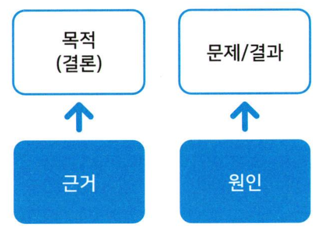
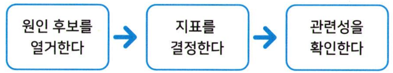

# 데이터 문해력 4주차 정규과제

📌데이터 문해력 정규과제는 매주 정해진 분량의 『*빅데이터 시대, 성과를 이끌어 내는 데이터 문해력*』 을 읽고 학습하는 것입니다. 이번 주는 아래의 **Data Literacy_4th_TIL**에 나열된 분량을 읽고 `학습 목표`에 맞게 공부하시면 됩니다.

아래의 문제를 풀어보며 학습 내용을 점검하세요. 문제를 해결하는 과정에서 개념을 스스로 정리하고, 필요한 경우 추가자료와 교재를 다시 참고하여 보완하는 것이 좋습니다.

4주차는 `4부. 결과가 나왔다고 끝난 것은 아니다` 를 읽고 새롭게 배운 내용을 정리해주시면 됩니다.


## Data Literacy_4th_TIL

### 4장. 결과가 나왔다고 끝난 것은 아니다

#### 4-1. 최종 목표는 '행동과 판단'

#### 4-2. 데이터에서 원인을 찾는 사고방식과 방법

#### 4-3. 알아두어야 할 주의사항


## 주차별 학습 (Study Schedule)

| 주차  | 공부 범위       | 완료 여부 |
| ----- | --------------- | --------- |
| 1주차 | 1장 p.13~32     | ✅         |
| 2주차 | 2장 p.33~78     | ✅         |
| 3주차 | 3장 p.79~130    | ✅         |
| 4주차 | 4장 p.131~166   | ✅         |
| 5주차 | 5장 p.167~190   | 🍽️         |
| 6주차 | 6장 p.191~208   | 🍽️         |
| 7주차 | 7,8장 p.209~236 | 🍽️         |

<!-- 여기까진 그대로 둬 주세요-->


---

# 1️⃣ 개념정리

## 01. 최종 목표는 '행동과 판단'

```
✅ 학습 목표 :
* 데이터 분석의 결과를 바탕으로 구체적인 행동과 의사결정으로 연결하는 사고 과정을 설명할 수 있다. 
* 데이터 분석의 목적은 '실행 가능한 판단'임을 이해한다. 
```


☑️ 데이터 분석의 최종 목표
- 결론으로 유도하지 못하는 정보는 가치가 없음. <- 데이터 정리에 불과함.
- 결과에 대한 **원인** 파악이 필요함. (문제의 원인 -> 해결방안)
    - 


## 02. 데이터에서 원인을 찾는 사고방식과 방법

```
✅ 학습 목표 :
* 데이터로부터 인과관계를 유추하는 사고방식과 그 한계를 이해한다.
* 상관관계와 인과관계의 차이를 구분하고, 원인을 도출하기 위한 기초적 조건들을 설명할 수 있다. 
```

☑️ 문제에 대한 **원인** 을 데이터로 분석하는 법

✔️ 원인 후보를 이끌어 내는 방법과 지표를 특정하는 방식

 일반적으로 2개 이상의 원인 고려해야 함. (7장에서 자세히 설명예정)

✔️ 데이터 수집이 어려운 경우
1. 유사한 데이터가 무엇일지 생각해보기
2. 수집 시작
3. 정량이 아닌 정성적인 정보로 대응(설문조사 응답 및 청취 자료 등)
4. 포기..(가정을 통해 보완하기
)

-> 중요한 건 '원인'에 대해 생각해보는 단계를 거쳤는지 여부임!

✔️ 문제와 원인의 관련성을 확인하는 방법
1. 시각적으로 확인하기
    - (산포도) 세로축: 문제와 결과에 대한 지표, 가로축: 원인 후보 지표
2. 통계 지표 확인하기 _ 상관계수
   
    


## 03. 알아두어야 할 주의사항

```
✅ 학습 목표 :
* 분석 결과를 과도하게 일반화하거나 확정적으로 해석하는 위험성을 인식한다.
* 데이터 기반 판단이 항상 '정답'을 보장하지 않음을 이해하고, 비판적 사고력을 기른다. 
```

☑️ 결론을 내릴 때 중요한 점

✔️ 직접적/간접적 관계인지?

✔️ 원인은 여러가지거나, 복잡할 수 있다

✔️ 선형이 아닌 관계성도 존재한다

✔️ 상관관계는 인과관계를 나타내는 것이 아니다(인과는 '해석')


<br>
<br>

---

# 2️⃣ 확인 문제

## 문제 1.

> **🧚Q. 재원이는 중앙대학교 기초 통계학 수업의 조교이다. 최근 기초 통계학 수업의 평균 성적이 작년보다 15점 하락한 것을 확인하고 교수님께 이렇게 말했다. "이번 학기부터 대면 수업으로 바뀐게 성적 하락의 원인이라고 봐요, 교수님. 비대면 온라인 수업할 때 평균이 더 높았잖아요?". 이 말을 들은 교수님은 "재원아, 너의 말에 오류가 있어. 조금만 더 생각해보고 와봐" 라고 말씀하셨다.**
>
> **재원이의 분석은 어떤 점에서 원인 해석과 인과 추론에 오류가 있는지 3가지의 근거를 바탕으로 서술해보세요.**

<!--학습한 개념을 활용하여 자유롭게 설명해 보세요. 구체적인 예시를 들어 설명하면 더욱 좋습니다.-->

```
1. 상관관계는 인과관계를 나타내는 것이 아니다. 재원이는 '수업방식'과 '성적하락'이 나타났다는 사실만 보고 대면 수업이 원인이라고 단정했다. 상관관계는 인과관계가 아니기 때문에 다른 요인들도 살펴보아야 한다.
2. 비교 집단이 통계적으로 동질한 조건인지 확인해야 한다. 이전 학기들과 이번 학기 수강생은 같은 조건을 가지지 않을 가능성이 높기 때문에 단순히 비교해서는 안 된다. 
3. 원인은 여러가지일 수 있다. 수업 방식 이외에도 시험 난이도, 학습 환경 등 여러 원인이 후보가 될 수 있기 때문에 종합적으로 해석해야 한다. 
```

### 🎉 수고하셨습니다.
