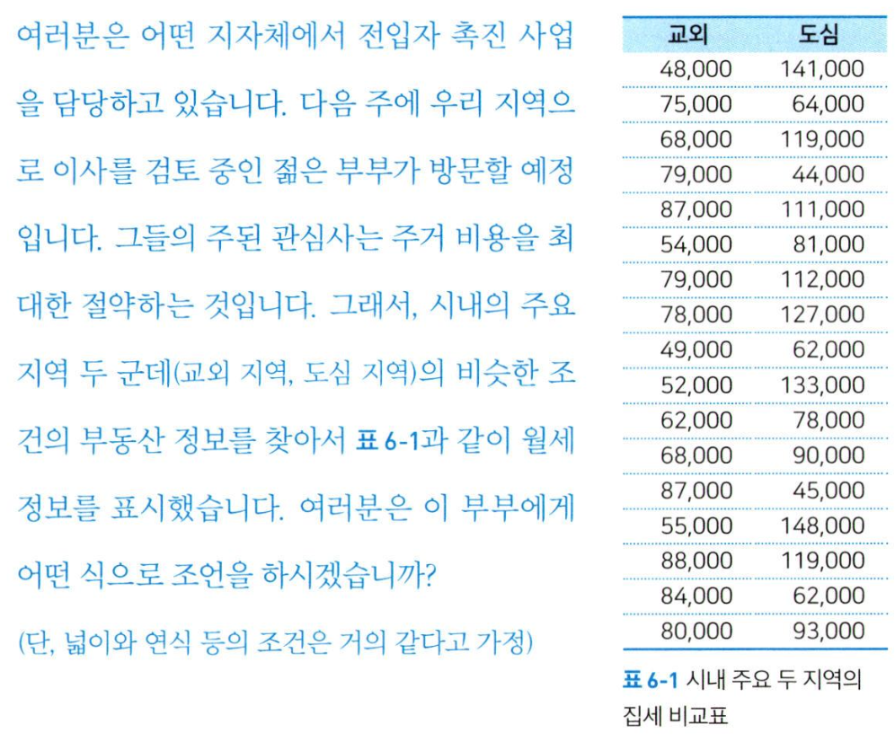
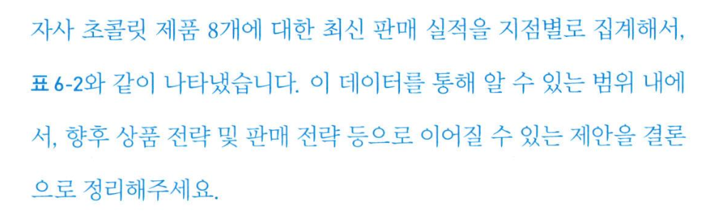
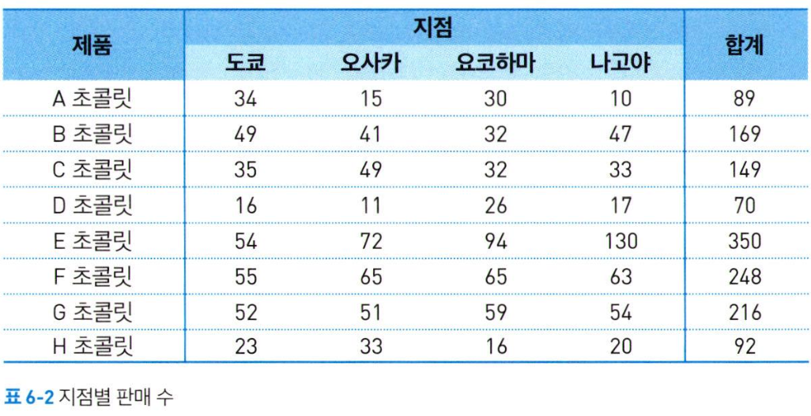

# 데이터 문해력 6주차 정규과제

📌통계학 정규과제는 매주 정해진 분량의 『*빅데이터 시대, 성과를 이끌어 내는 데이터 문해력*』 을 읽고 학습하는 것입니다. 이번 주는 아래의 **Data Literacy_6th_TIL**에 나열된 분량을 읽고 `학습 목표`에 맞게 공부하시면 됩니다.

아래의 문제를 풀어보며 학습 내용을 점검하세요. 문제를 해결하는 과정에서 개념을 스스로 정리하고, 필요한 경우 추가자료와 교재를 다시 참고하여 보완하는 것이 좋습니다.

6주차는 `6부. '결론은 이것이다' 정보를 요약하라` 를 읽고 새롭게 배운 내용을 정리해주시면 됩니다.


## Data Literacy_6th_TIL

### 6장. '결론은 이것이다' 정보를 요약하라

#### 6-1. 결과와 결론은 다르다

#### 6-2. '결과'와 '결론'의 차이 : 데이터를 너무 단순하게 이해한 사례 

#### 6-3. 결론을 낼 때 주의해야 할 점


## 주차별 학습 (Study Schedule)

| 주차  | 공부 범위       | 완료 여부 |
| ----- | --------------- | --------- |
| 1주차 | 1장 p.13~32     | ✅         |
| 2주차 | 2장 p.33~78     | ✅         |
| 3주차 | 3장 p.79~130    | ✅         |
| 4주차 | 4장 p.131~166   | ✅         |
| 5주차 | 5장 p.167~190   | ✅         |
| 6주차 | 6장 p.191~208   | ✅         |
| 7주차 | 7,8장 p.209~236 | 🍽️         |

<!-- 여기까진 그대로 둬 주세요-->


---

# 1️⃣ 개념정리

## 01. 결과와 결론은 다르다

```
✅ 학습 목표 :
* 데이터 분석 결과와 해석을 통해 내리는 결론을 구분되어야 함을 이해한다.
```

### 정보 집약력: 정보를 수집하고 결론을 이끌어내는 힘
- 데이터 수집, 처리, 분석 '다음'의 과정! = '결론을 서술한다'
- 결과 : 계산과 분석을 해서 나온 결과물
- 결론 : 그 결과가 목적에 대해 어떤 의미가 있는지 설명하는 것

> 결론은 결과에 기반해 도출해야 한다
>> 결론과 결과는 본질적으로 같지만, 표현방식이 다르다. 
>> 목적, 무엇을 말하고 싶고, 말해야 하는지, 상대방이 알고 싶어 하는 것은 무엇인지 명확히 할 것. 


> 정답 위주의 교육 현실
>> 분석을 통해 결과물을 도출하는 것이 목적이 되어버리는 문제점. 
>> 결론을 내기 위한 실천적인 훈련이 필요함.


## 02. '결과'와 '결론'의 차이 : 데이터를 너무 단순하게 이해한 사례 

```
✅ 학습 목표 :
* 데이터 수치를 지나치게 단순하게 해석할 때 발생할 수 있는 오류를 사례를 통해 파악한다. 
* 동일한 결과라도 결론은 다양하게 나올 수 있음을 인식하고, 관점의 중요성을 설명할 수 있다. 
```

> 사례1
 <br>
>> 부부에게 있어서 가치 있는 정보(제안)은 무엇일까?
>> **다면적인 정보에 대한 파악**
>> 표준편차 -> 집세의 분산 상태 : 시세는 교외가 싼 편이지만 도심 쪽이 선택의 폭이 압도적으로 넓음


> 사례2_그래프를 효과적으로 사용해 결론을 내린 사례

 <br>
>> 제품별 합계 판매 실적을 많은 것부터 순서대로 정렬 : 제품별 판매 실적 크기를 결론으로 연결하기 


## 03. 결론을 낼 때 주의해야 할 점

```
✅ 학습 목표 :
* 결론 도출 시 반드시 점검해야할 부분을 습득한다. 
* 데이터를 통해 얻은 인사이트를 왜곡 없이 요약하는 방법을 설명할 수 있다. 
```


* **필요 이상으로 자신의 해석을 덧붙이지 않아야 함**

1. 데이터로 설명 가능한 범위인가?
- 어디까지가 데이터를 통한 사실이고 자신의 상상인지의 경계를 뚜렷하게 두어야 함. 
- 자기 나름의 해석을 해도, 그 범위를 최소한으로 한정하여야 함. 

2. 인지 편향(선입견)
- 의도와 관계없이, 자신에게 더 유리한 정보에 치우쳐 분석하거나 더 유리하게 해석하여 결론을 내리는 경우가 많음. (과도한 일반화)

3. 정답은 하나가 아니다. 
- 스스로 정답을 만들어내고 이를 논한다는 자세를 흔들림 없이 유지해야 함. 


<br>
<br>

---

# 2️⃣ 확인 문제

## 문제

> **🧚Q. 맛집을 탐방하여 이를 인스타를 활용하여 홍보하는 미정이는 SNS 콘텐츠 개선을 위해 인스타그램 게시물 통계를 분석했다. 지난 3개월간 업로드된 게시물 30개의 좋아요 수 평균이 120개였고, 그중에서 가장 많은 좋아요(480개)를 받은 게시물이 '중앙대학교 특집 맛집 탐방'이라는 결과를 도출했다.**
>
> **이를 보고 미정이는 이러한 생각을 했다. '중앙대 근처 맛집 탐방 콘텐츠가 압도적으로 반응이 좋으니, 앞으로는 대학가 근처의 콘텐츠를 제작하는게 맞는 것 같다.'**
>
> **미정이의 분석 결과와 결론 사이에는 어떤 논리적 비약 또는 해석의 오류가 있나요? 아래 항목을 중심으로 2~3가지 근거를 들어 설명해보세요.**
>
> **'좋아요 수'라는 결과 지표 / 하나의 사례만으로 결론 도출 / 다른 가능성 검토 여부**


<!--학습한 개념을 활용하여 자유롭게 설명해 보세요. 구체적인 예시를 들어 설명하면 더욱 좋습니다.-->

```
'좋아요 수'라는 결과 지표에는 노출도, 게시물을 올리는 시간대 또는 시기 등 여러 요인이 작용한다. 따라서 가장 많은 '좋아요 수'가 반드시 '중앙대학교 특집 맛집 탐방' 게시물의 인기가 가장 좋다라는 결론으로 바로 이어지면, 데이터만을 통해 결론을 도출했다고 보기 어렵게 된다. 
미정이는 '중앙대학교'라는 하나의 사례로 '대학가 근처'라고 일반화하여 결론을 도출했다. 과도한 일반화는 잘못된 결론을 도출할 수 있다는 점을 인지하고 다른 대학들에 대해서도 조사해볼 필요가 있다. 
또한 '대학가의 맛집'라는 콘텐츠의 내용뿐만 아니라 게시글을 작성할 때 어떤식으로 글을 작성했는지, 피드의 사진은 어떤 구성으로 올렸는지(꾸몄는지) 등등 다른 가능성도 충분히 검토할 필요성이 있다. 
```


### 🎉 수고하셨습니다.
