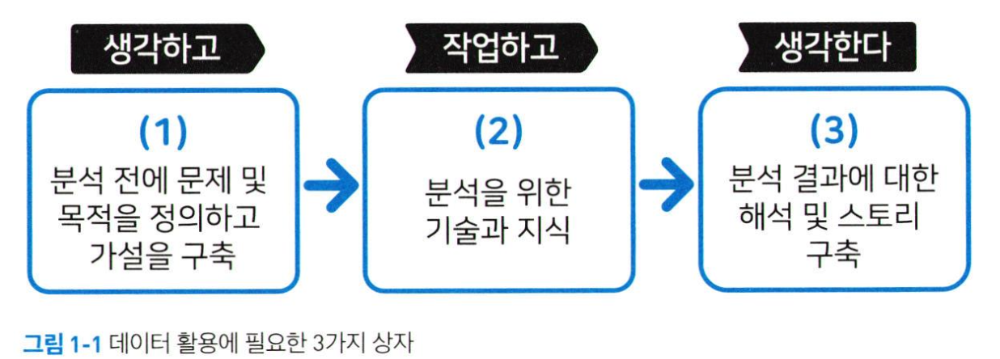
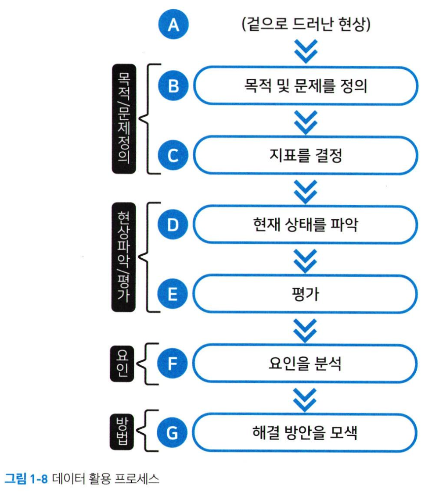

# 데이터 문해력 1주차 정규과제

📌통계학 정규과제는 매주 정해진 분량의 『*빅데이터 시대, 성과를 이끌어 내는 데이터 문해력*』 을 읽고 학습하는 것입니다. 이번 주는 아래의 **Statistics_1th_TIL**에 나열된 분량을 읽고 `학습 목표`에 맞게 공부하시면 됩니다.

아래의 문제를 풀어보며 학습 내용을 점검하세요. 문제를 해결하는 과정에서 개념을 스스로 정리하고, 필요한 경우 추가자료와 교재를 다시 참고하여 보완하는 것이 좋습니다.

1주차는 `1부. 앞으로 필요한 건 데이터 문해력: 분석보다 활용` 를 읽고 새롭게 배운 내용을 정리해주시면 됩니다.


## Statistics_1th_TIL

### 1장. 앞으로 필요한 건 데이터 문해력 : 분석보다 활용
#### 1-1. 기계가 할 일과 사람이 할 일

#### 1-2. 통계를 배워도 왜 활용하지 못하나?

#### 1-3. 데이터를 먼저 보지 마라 - 데이터 안에 답은 없다.


## 주차별 학습 (Study Schedule)

| 주차  | 공부 범위       | 완료 여부 |
| ----- | --------------- | --------- |
| 1주차 | 1장 p.13~32     | ✅         |
| 2주차 | 2장 p.33~78     | 🍽️         |
| 3주차 | 3장 p.79~130    | 🍽️         |
| 4주차 | 4장 p.131~166   | 🍽️         |
| 5주차 | 5장 p.167~190   | 🍽️         |
| 6주차 | 6장 p.191~208   | 🍽️         |
| 7주차 | 7,8장 p.209~236 | 🍽️         |

<!-- 여기까진 그대로 둬 주세요-->


---

# 1️⃣ 개념정리
## 01. 기계가 할 일과 사람이 할 일

```
✅ 학습 목표 :
* 데이터 시대에 기계와 인간의 역할 차이를 이해한다.
* 인간이 데이터 해석에서 수행해야 할 판단과 책임의 중요성을 인식한다. 
```
<!-- 새롭게 배운 내용을 자유롭게 정리해주세요.-->
기본적으로 데이터에서 무엇을 뽑아내고, 어떠한 결론을 내릴 것인가에 대한 물음을 해결하기 위해서 1. 통계학 지식 2. 분석 이론 및 방법 3. 데이터 가공 및 분석 작업 방식 을 배울 필요가 있다.

하지만 이는 사람보다 기계가 훨씬 더 잘한다. 그렇다면, 위와 같은 기술을 굳이 시간과 비용을 들여 공부할 필요가 있을까?

데이터 과학자나 개발자같은 기계(도구)에 대한 구조와 원리를 알아야 하는 사람들에게는 필수적인 지식이다. 이런 전문 직종 종사자가 아니라면? 자신만의 특별한 목적을 데이터를 통해 해결해보고 싶은 사람이라면? 자신에게 필요한 것이 무엇인지 구분해서 공부하는 것이 중요하다. 

데이터를 최대한 활용하고 가치 있는 결과물을 도출하려면 우리가 직접 익혀야 하는 고도로 가치 있는 기술이 필요하다. 


## 02. 통계를 배워도 왜 활용하지 못하나

```
✅ 학습 목표 :
* 통계 지식이 잘 활용되지 못하는 이유를 설명하고, 실무에 필요한 통계적 사고의 핵심 요소를 말할 수 있다.
* 기술 자체보다는 문해력과 사고력의 중요성을 인식한다. 
```

<!-- 새롭게 배운 내용을 자유롭게 정리해주세요.-->

(1)과 (3)에서의 분석 목적 정의와 결과 해석이 데이터를 잘 활용하기 위해 반드시 필요한 과정이다. (2)도 물론 중요하지만 결과에 지나지 않는다. 

야구의 규칙을 안다((2)에 관한 지식이 있다)고 해서 안타를 칠 수 있는 것(데이터를 잘 활용한다)은 아니다. (1), (3)과 같이 통계과 분석 방법을 활용하기 위한 '사고방식'이 필요하다. -> **가치 높은 기술**

목표를 명확히 인식할 필요가 있다. 
- 작업에 사용하는 기술을 개발할 것인가
- 입력 및 결과물에 대한 기술을 향상시킬 것인가

데이터 문해력(literacy): 사람이 가치를 창출할 수 있는 '생각'의 부분인 고부가가치 기술


## 03. 데이터를 먼저 보지 마라 - 데이터 안에 답은 없다
```
✅ 학습 목표 :
* 책에서 말하고자 하는 데이터 활용 프로세스에 대해 이해한다.
* '데이터 활용을 못 하는' 사람들의 공통점인 과제를 인식한다.
```
<!-- 새롭게 배운 내용을 자유롭게 정리해주세요.-->
| '데이터와 그래프 중심 사고' | '목적 사고력' |
|-------|-------|
| 단순히 데이터와 그래프를 읽어내는 것을 추구 | 데이터를 보기 전, 자신의 목적에 집중하여 작업을 진행 |
| - | 데이터 문해력 |

데이터 활용을 못하는 사람의 문제점
1. 데이터를 적절하게 분석하면 문제와 목적, 결론이 나올 것으로 생각한다
2. 눈앞의 데이터를 적절히 가공하면 유용한 정보를 얻을 것으로 생각한다. 아무것도 나오지 않는다면, 분석 방법에 문제가 있다고 생각한다.

데이터 안에는 답이 없다. 데이터 분석 자체가 목적이 되는 것을 경계하라. 
데이터를 적절하게 활용하여 가치 있는 결과물을 낼 수 있도록 하는 사고방식(데이터 문해력)이 필요하다. 



<br>
<br>

# 2️⃣ 확인 문제

## 문제 1.

> **🧚Q.지민이는 데이터 리터러시에 익숙하지 않은 마케터입니다. 최근 자사 제품에 대한 설문 조사 결과를 보고 아래와 같은 결론을 내렸습니다.**
>
> *지민* : **설문 응답자의 70%가 '제품에 만족한다'고 답했어요. 그러니 이번 제품은 성공적이에요! 이제 발표자료만 만들면 될 것 같아요.**
>
> **하지만 동료인 승화는 다음과 같은 반론을 제기했습니다.**
>
> *승화* : **그렇게 말하기엔 이 결과만으로는 부족한 것 같아요. 응답자가 누구고, 왜 응답했는지부터 먼저 생각해 봐야 하지 않을까요?**
>
> **위 사례에서 지민이의 결론이 왜 데이터 문해력 관점에서 문제 정의와 해석 측면에서 부족한지 설명하세요. 책에서 `데이터 활용에 필요한 3가지 상자` 에서 어느 단계가 잘못되었는지 지적하고, 올바른 사고 흐름을 제시해보세요.**


<!--학습한 개념을 활용하여 자유롭게 설명해 보세요. 구체적인 예시를 들어 설명하면 더욱 좋습니다.-->

<!-- 데이터 문해력의 흐름에 대한 문제입니다. -->

```
사례의 지민이는 단순히 설문 결과만 보고 데이터를 해석하고 있다. (2)분석을 위한 기술과 지식만을 보고 (3)의 결론을 도출해내려고 하는 것이다. 이는 데이터와 그래프 중심의 사고로 목적과 맞지 않는 결론이 나올 수 있다. 
데이터를 올바르게 분석하고 활용하기 위해서는 내가 해결하고자 하는 문제가 무엇이고 데이터 활용의 목적이 무엇인지를 우선적으로 정의해야 한다. 그리고 나서 그 목적에 맞게 데이터를 수집하고 분석해서 그 결과를 검증하고 결론을 도출하는 방식으로 진행되어야 한다. 
```

### 🎉 수고하셨습니다.
