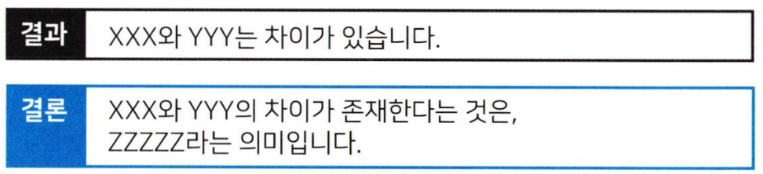
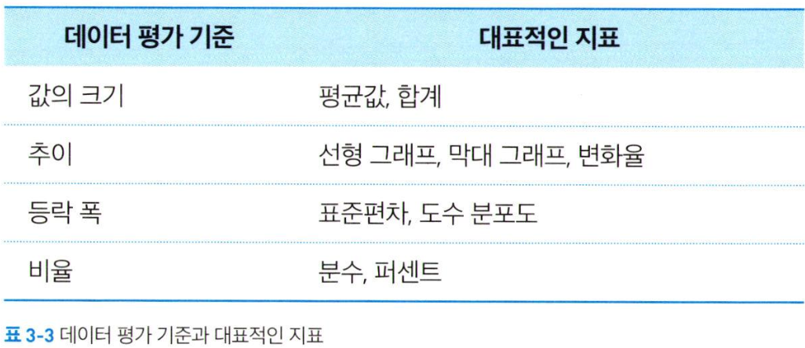

# 데이터 문해력 3주차 정규과제

📌데이터 문해력 정규과제는 매주 정해진 분량의 『*빅데이터 시대, 성과를 이끌어 내는 데이터 문해력*』 을 읽고 학습하는 것입니다. 이번 주는 아래의 **Data Literacy_3rd_TIL**에 나열된 분량을 읽고 `학습 목표`에 맞게 공부하시면 됩니다.

아래의 문제를 풀어보며 학습 내용을 점검하세요. 문제를 해결하는 과정에서 개념을 스스로 정리하고, 필요한 경우 추가자료와 교재를 다시 참고하여 보완하는 것이 좋습니다.

3주차는 `3부. '이것이 문제다' 데이터로 말하는 방법` 를 읽고 새롭게 배운 내용을 정리해주시면 됩니다.

## Data Literacy_3rd_TIL

### 3장. '이것이 문제다' 데이터로 말하는 방법

#### 3-1. 결과와 평가는 다르다

#### 3-2. 비교할 때는 관점이 중요하다 

#### 3-3. 비교의 기술

#### 3-4. 비교 사례 분석


## 주차별 학습 (Study Schedule)

| 주차  | 공부 범위       | 완료 여부 |
| ----- | --------------- | --------- |
| 1주차 | 1장 p.13~32     | ✅         |
| 2주차 | 2장 p.33~78     | ✅         |
| 3주차 | 3장 p.79~130    | ✅         |
| 4주차 | 4장 p.131~166   | 🍽️         |
| 5주차 | 5장 p.167~190   | 🍽️         |
| 6주차 | 6장 p.191~208   | 🍽️         |
| 7주차 | 7,8장 p.209~236 | 🍽️         |

<!-- 여기까진 그대로 둬 주세요-->


---

# 1️⃣ 개념정리

## 01. 결과와 평가는 다르다

```
✅ 학습 목표 :
* 수치로 나타난 결과와 그에 대한 평가는 구분되어야 함을 이해한다.
* 결과를 해석할 때 반드시 목적과 기준을 명화히 해야 함을 인식한다. 
```

<현황 파악을 위해 구분해야 하는 것>
- 성과 및 사실, 결과를 확인할 것.
- 그 결과에 대한 평가를 진행할 것. 

<가치 있는 정보>
- 구체적인 행동을 특정할 수 있다(누가 언제 무엇을?).
- 구체적인 판단을 내릴 재료가 된다. 

<평가와 판단을 위해 필요한 것>
- 어느 쪽이 더 효율적인가.
- 어느 쪽이 더 효과적인가.
- 어느 쪽이 더 중요한가. 
- 어느 쪽이 더 긴급한가.
=> **우선순위** 정하기 

> `사실과 결과의 데이터를 그래프, 표, 지표 등으로 표시하는 것` 과 `내용을 평가해서 구체적인 행동과 판단으로 연결하는 것` 을 구분 -> `평가를 준비하는 것` 이 중요.

## 02. 비교할 때는 관점이 중요하다

```
✅ 학습 목표 :
* 같은 데이터라도 해석 관점에 따라 전혀 다른 메시지가 도출될 수 있음을 이해한다.
* 비교 대상, 비교 기준, 목적을 명확히 해야 의미 있는 비교가 가능함을 설명할 수 있다. 
```

`비교` 
- 단순하게 값의 크기를 비교하는 것은 제대로 된 평가가 아님. -> 주관적
- 다른 것과의 비교 -> `객관성` & `논리성` 확보

‼️결론을 심정적으로 정해놓고 데이터를 바라보면 결론과 데이터 사이에 논리적인 괴리가 생길 수 있으므로 주의가 필요함. 

<비교 시 체크포인트>

✅ 결론으로 이어지는 결과가 나올 것인가
- 목적에 따라 데이터를 바라보고 결론을 내림. 
- 이를 확인하는 방법?
    - 최종적으로 결과가 아닌 **결론**이 서술되어 있는가
    
    - 내가 말하고자 하는 바와, 인식하는 문제에 대한 정의가 명확해야함. 


✅ 비교를 통해 '차이'를 알 수 있는가
- 여러 비교 대상 후보를 정하고, 각각 비교를 진행 -> 결과와 결론의 일관성 확인 -> (경우에 따라 비교 대상 조정) 가설 -> 검증 반복
- 내부 비교
    - 자사 제품의 총 매출 비교 by 지역
- 외부 비교 
    - 자사 제품 vs 타사 제품


## 03. 비교의 기술

```
✅ 학습 목표 :
* 데이터 비교에서 편차, 표준편차의 사용되는 과정을 이해한다.
* 지표의 선택과 해석이 결과에 미치는 영향을 판단할 수 있다. 
```

<추이와 변화를 본다>
- 단순 평균 비교가 아닌 추이를 보는 것. 

<편차를 고려한다>
- 도수 분포도 -> 데이터의 분포와 편차를 한눈에 파악 => 데이터가 복잡한 경우 시각적인 정보만으로는 정량적 판단을 하기에 한계가 있음. 
- `표준편차`활용 -> 값에만 의존하지 말고 그래프 등을 통해 총체적으로 관찰해야함. 
    - 편차가 크다? : 데이터 목적에 따라 의미가 달라짐. 

<평가 기준의 정리>
- 


## 04. 비교 사례 분석 

~~~
✅ 학습 목표 :
* 실제 사례를 통해 데이터 비교에서 발생할 수 있는 상황들을 식별한다.
* 다양한 맥락에서 의미 있는 비교를 하기 위한 분석적 사고력을 기른다. 
~~~

1️⃣ 평가를 하려면 비교 대상을 어떻게 정해야 하는가?

2️⃣ 어떤 평가 기준을 활용해서 비교할 것인가?

<인구 문제를 다룬 경우>
1. 메구로구 인구 추이 그래프 -> 평가 how? 비교 대상 what?
2. 비교 대상) 가까운 지역? 도쿄 23구 내?(생활환경 고려)
3. 내부 비교

<고객 만족도를 다룬 경우>
- 평균이 아니라 데이터의 분포 상태를 통해 보는 고객 만족도 사례
- 선입견을 버리고 서비스 만족도 측정
- 서비스 만족도의 측정 방법

<노동시간, 시간 외 근무시간을 다룬 경우>
- 시간 외 근무 시간 평균으로 볼 때 -> 개개인에 초점을 맞춘 지표가 아님.
- 목적에 이르는 적절한 접근법

<공영 시설 이용 현황을 다룬 경우>
- 산포도를 통해 살펴본다 <- 값의 크기 기준 + 추이, 비율 기준

> 비교 총정리
>> - 목적: 비교를 통해 평가
>> - 기술: 값의 크기, 추이, 편차, 비율 -> 데이터의 특징 파악


<br>
<br>

# 2️⃣ 확인 문제

## 문제 1.

> **🧚Q. 예린이는 연애 관련 컨텐츠를 제작하는 회사의 지인에게 부탁을 받아 '서울의 인기있는 데이트 코스 TOP 3'를 정하기 위해 각 장소에 대한 온라인 후기 평점을 수집했습니다. 온라인 후기 평점은 아래와 같습니다.**

| **장소**        | **평균 평점** | **평점 수** | **평점 편차 (표준편차)** |
| --------------- | ------------- | ----------- | ------------------------ |
| 익선동 한옥마을 | 4.8           | 1,000       | 0.3                      |
| 성수동 카페거리 | 4.7           | 950         | 0.9                      |
| 한강 공원       | 4.6           | 1,200       | 1.4                      |

> **예린이는 평균 평점을 보고, "오! 익선동 한옥마을이 가장 높고 안정적이니까 무조건 1위네" 라고 말하고 이를 지인에게 전달했습니다.**
>
> **위 사례에서 예린이의 접근 방식은 데이터 문해력 관점에서 타당한지, 각 장소의 평점에 담긴 의미를 활용해 비교해보세요.**


<!--학습한 개념을 활용하여 자유롭게 설명해 보세요. 구체적인 예시를 들어 설명하면 더욱 좋습니다.-->

```
각 장소에 대한 평균 평점은 평가한 사람들 각각의 기준에 따라 달라질 수 있다. 따라서 평균 평점이라는 지표 하나만 보고 판단하면 데이터를 잘못 파악하고 잘못된 결론으로 도달할 수도 있다. 
평점 수를 보아 세 장소 모두 비슷한 표본의 크기를 가지고 있다고 볼 수 있다. 평점 편차는 평균 평점에서 각 평점 후기들이 얼마나 많이 퍼져있는지를 알 수 있는 지표이다. 익선동 한옥마을은 가장 높은 평균 평점을 받은 동시에 편차 또한 가장 작아, 이는 후기 작성자들이 대부분 4.8 언저리의 평점을 남겼다고 해석할 수 있다. 그 반면 나머지 성수동 카페거리나 한강공원은 편차가 크므로 작성자들의 평점 차이가 크다는 것을 의미한다. 이를 종합적으로 보아, 익선동 한옥마을이 나머지 장소들에 비해 인기있는 데이트 코스 장소일 것이다라는 결론에 도달할 수 있을 것이다. 
```

### 🎉 수고하셨습니다.
